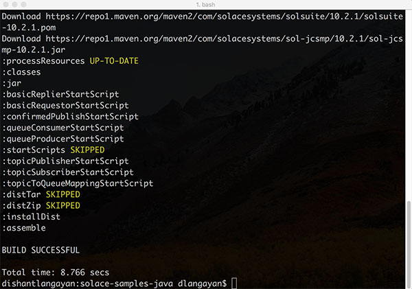

# DEV 101 - Introduction to Solace Development

This guide contains prerequisites &amp; setup instructions for the Intro to Solace Development (a.k.a DEV-101) public training course.

**NOTE:** You are required to bring your own laptop for performing hands-on lab exercises and viewing course material. Below instructions assume you have administrator privileges to install software and run Java-based programs on your laptops.

We suggest you download all the software ahead of the course.

## Table of Contents

* [Solace Cloud Messaging (Solace Cloud)](#Solace-Cloud)
* [Sample Applications](#Sample-Apps)
* [Required Software Tools](#Required-Software-Tools)

## Solace Cloud Messaging (Solace Cloud)

During the course your instructor will guide you through creating a [Solace Cloud](https://cloud.solace.com/) account, which you will use for connecting your applications to Solace's messaging-as-a-service and run all coding lab exercises. 

If you would like to get a head start, then sing-up for your free account here: [https://cloud.solace.com/signup/](https://cloud.solace.com/signup/)

## Sample Apps

You will be using Solace's Java samples on Github as a starting point for the coding lab exercises. The samples use Gradle as the build system to compile the code and generate executables. 

Clone or download the following sample: 

[https://github.com/SolaceSamples/solace-samples-java](https://github.com/SolaceSamples/solace-samples-java)

Then run: `./gradlew clean assemble` on a MacOS/Linux or `gradlew.bat clean assemble` from a Windows command prompt. This will download Gradle if not already installed on your system, and then compile the samples:

We will cover these samples and Solace API dependency management in the course.

## Required Software Tools

Throughout the course you will be developing Java based applications & running the samples above that connect to your free Solace Cloud account. Most developers will likely have a Java dev environment setup on their laptops, but if you don't then you can download and install the following: 

* **[SolAdmin](#SolAdmin)** - Solace's GUI-based administration tool to manage a Solace VMR
* **[IDE / Code Editor](#IDE)** - an IDE such as Eclipse, Intellij, or just Visual Studio Code for developing Java based applications
* **[Curl CLI Tool](#Curl)** - to send HTTP requests

### SolAdmin

SolAdmin is a Java-based GUI tool for administerig and managing your Solace Cloud messaging-as-as-service. You can download and install SolAdmin from here:

* [http://dev.solace.com/downloads/#apis-protocols-tools](http://dev.solace.com/downloads/#apis-protocols-tools)

We will cover usage of SolAdmin on Day 1 of the course, so all you need to do is make sure it is downloaded and installed on your laptop.

### IDE / Code Editor

You can use any of your favorite IDE or Java code editor. Some of the most popular ones are:
* [Visual Studio Code](https://code.visualstudio.com/)
* [Eclipse IDE for Java](http://www.eclipse.org/downloads/)
* [Intellij IDEA](https://www.jetbrains.com/idea/)

### Curl CLI Tool

If you use Mac/UNIX based OS then you will already have Curl install on your system. 

Check by running `curl --verion` on your Terminal window. 

If you use a Windows based OS, then you can download Curl from here: (https://curl.haxx.se/dlwiz/)

